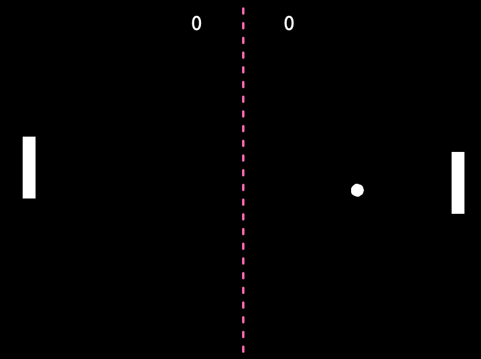
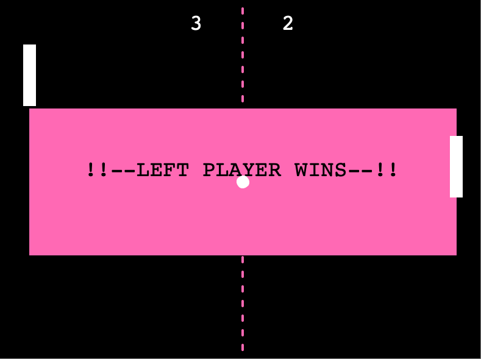

# 🏓 Pong Arcade Game using `turtle` Library

Aren't you bored sometimes and just to play a simple game with your office bestie—or alone, no judgment here🤗—during breaks? This is an arcade classic game of pong, created in Python using `turtle` library for GUI of the application. 

This game is created as a part of the [Python Bootcamp](https://github.com/GrichSHiran/london-app-brewery-python-bootcamp-projects). 

## Installation
For this application, you don't need to install any additional package as [`turtle` library](https://docs.python.org/3/library/turtle.html) is a part of the [Python Standard Library](https://docs.python.org/3/library/index.html).

Once you have cloned the project, you can directly run `main.py` and the game would work out of the box.

## Gameplay
Use paddle controls and try to block the pong ball off from reaching your side. Each time the ball lands on one side, the other side score one point. The first player to reach the score limit wins the game.

## Default Configuration
The default score limit is set to 3. The paddle up/down controls are `i` and `k` for the right-side player, `e` and `d` for the left-side player. You can customized the configuration directly on `main.py` through changing the top-level constants.
